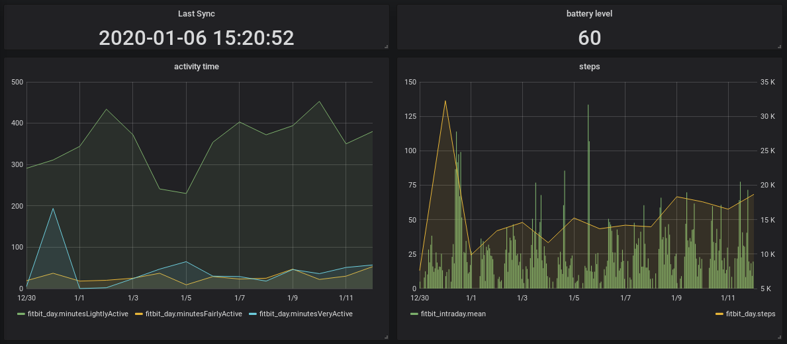

# Galileo

This is a fork of Benoît Allard's [`galileo`](https://bitbucket.org/benallard/galileo). See [original readme](README.txt).

This repo is an attempt to make `galileo` work out of the box with Fitbit ZIP on my linux laptops via built-in bluetooth.

# Sync workflow

- [galileo (this repo)](https://github.com/nagimov/galileo) for syncing with Fitbit servers
- [python-fitbit](https://github.com/orcasgit/python-fitbit) with [Selenium](https://github.com/SeleniumHQ/Selenium) for scraping data back from Fitbit servers in hour/minute resolution (note: application token must to be obtained first, see [this tutorial](https://towardsdatascience.com/collect-your-own-fitbit-data-with-python-ff145fa10873))
- [InfluxDB](https://www.influxdata.com/products/influxdb-overview/) + [Grafana](https://grafana.com/) for DB and and pretty dashboards

